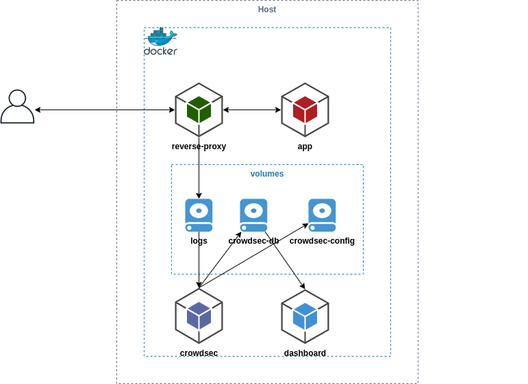

# Docker Compose

This example explains how to integrate crowdsec in environment deployed with docker-compose. It set up multiple containers :

## Prerequisites: Docker / Docker Compose

## Step 0: Create docker-compose.yml

## Step 1: Create crowdsec with config + dashboard

## Step 2: Start the Containers

## Step 3: Install bouncer on host

## Step 4: Simulate an attack and check detection + prevention
